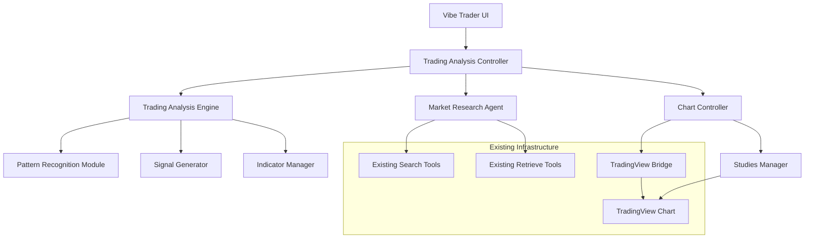
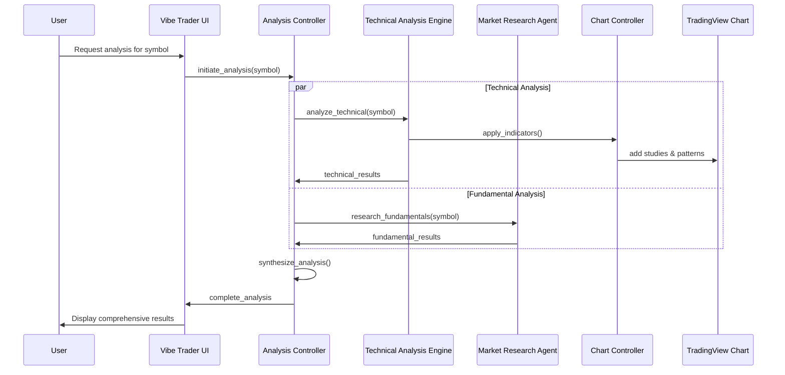

# Vibe Trader Design Document

## Overview

The Vibe Trader system transforms the existing Morphic AI-powered search application into an intelligent trading analysis platform. The system leverages the existing TradingView integration, AI agents, and search capabilities to provide automated technical and fundamental analysis with natural language interaction.

The design extends the current architecture by adding specialized trading analysis agents, chart control mechanisms, and a unified analysis interface that combines technical indicators, pattern recognition, and market research into actionable trading insights.

## Architecture

### High-Level Architecture



### Component Interaction Flow



## Components and Interfaces

### 1. Trading Analysis Controller

**Location**: `lib/agents/vibe-trader.ts`

The main orchestrator that coordinates all analysis components and manages the analysis workflow.

```typescript
interface TradingAnalysisController {
  initiateAnalysis(symbol: string, timeframe?: string): Promise<AnalysisResult>
  handleFollowUpQuery(query: string, context: AnalysisContext): Promise<string>
  updateAnalysis(symbol: string, parameters: AnalysisParameters): Promise<AnalysisResult>
}

interface AnalysisResult {
  symbol: string
  timestamp: Date
  technicalAnalysis: TechnicalAnalysisResult
  fundamentalAnalysis: FundamentalAnalysisResult
  recommendations: TradingRecommendation[]
  confidence: ConfidenceScore
  chartAnnotations: ChartAnnotation[]
}
```

### 2. Technical Analysis Engine

**Location**: `lib/agents/technical-analyzer.ts`

Processes price data and generates technical analysis insights.

```typescript
interface TechnicalAnalysisEngine {
  analyzePrice(symbol: string, timeframe: string): Promise<TechnicalAnalysisResult>
  identifyPatterns(priceData: PriceData): PatternResult[]
  calculateIndicators(priceData: PriceData): IndicatorResult[]
  generateSignals(analysis: TechnicalAnalysisResult): TradingSignal[]
}

interface TechnicalAnalysisResult {
  indicators: IndicatorResult[]
  patterns: PatternResult[]
  supportResistance: SupportResistanceLevel[]
  trend: TrendAnalysis
  momentum: MomentumAnalysis
  volatility: VolatilityAnalysis
}
```

### 3. Market Research Agent

**Location**: `lib/agents/market-researcher.ts`

Extends the existing researcher agent with trading-specific capabilities.

```typescript
interface MarketResearchAgent {
  researchFundamentals(symbol: string): Promise<FundamentalAnalysisResult>
  analyzeSentiment(symbol: string): Promise<SentimentAnalysis>
  getEconomicContext(symbol: string): Promise<EconomicContext>
  findUpcomingEvents(symbol: string): Promise<MarketEvent[]>
}

interface FundamentalAnalysisResult {
  companyInfo: CompanyInfo
  financialMetrics: FinancialMetrics
  newsAnalysis: NewsAnalysis
  sectorAnalysis: SectorAnalysis
  marketSentiment: SentimentScore
  upcomingEvents: MarketEvent[]
}
```

### 4. Chart Controller

**Location**: `lib/tv/chart-controller.ts`

Extends the existing TradingView bridge to provide automated chart manipulation.

```typescript
interface ChartController {
  applyIndicators(indicators: IndicatorConfig[]): Promise<void>
  drawPatterns(patterns: PatternResult[]): Promise<void>
  addPriceTargets(targets: PriceTarget[]): Promise<void>
  highlightLevels(levels: SupportResistanceLevel[]): Promise<void>
  setSymbolAndTimeframe(symbol: string, timeframe: string): Promise<void>
}

interface IndicatorConfig {
  name: string
  parameters: Record<string, any>
  visible: boolean
  style?: StyleConfig
}
```

### 5. Pattern Recognition Module

**Location**: `lib/analysis/pattern-recognition.ts`

Identifies technical chart patterns and formations.

```typescript
interface PatternRecognitionModule {
  identifyPatterns(priceData: PriceData): PatternResult[]
  findSupportResistance(priceData: PriceData): SupportResistanceLevel[]
  detectTrendLines(priceData: PriceData): TrendLine[]
  recognizeFormations(priceData: PriceData): Formation[]
}

interface PatternResult {
  type: PatternType
  confidence: number
  coordinates: ChartCoordinate[]
  description: string
  implications: string[]
  priceTargets: PriceTarget[]
}
```

### 6. Signal Generator

**Location**: `lib/analysis/signal-generator.ts`

Combines technical and fundamental analysis to generate trading recommendations.

```typescript
interface SignalGenerator {
  generateSignals(
    technical: TechnicalAnalysisResult,
    fundamental: FundamentalAnalysisResult
  ): TradingRecommendation[]
  calculatePriceTargets(analysis: AnalysisResult): PriceTarget[]
  assessRisk(recommendation: TradingRecommendation): RiskAssessment
}

interface TradingRecommendation {
  action: 'BUY' | 'SELL' | 'HOLD'
  confidence: number
  reasoning: string[]
  priceTargets: PriceTarget[]
  stopLoss: number
  timeHorizon: string
  riskLevel: 'LOW' | 'MEDIUM' | 'HIGH'
}
```

## Data Models

### Core Analysis Types

```typescript
interface PriceData {
  symbol: string
  timeframe: string
  data: OHLCV[]
  volume: number[]
  timestamp: Date[]
}

interface OHLCV {
  open: number
  high: number
  low: number
  close: number
  volume: number
  timestamp: Date
}

interface IndicatorResult {
  name: string
  values: number[]
  parameters: Record<string, any>
  interpretation: string
  signal: 'BULLISH' | 'BEARISH' | 'NEUTRAL'
}

interface PriceTarget {
  level: number
  type: 'ENTRY' | 'TARGET' | 'STOP_LOSS'
  confidence: number
  reasoning: string
}

interface ChartAnnotation {
  type: 'LINE' | 'SHAPE' | 'TEXT' | 'INDICATOR'
  coordinates: ChartCoordinate[]
  style: StyleConfig
  label?: string
  description?: string
}
```

### Market Research Types

```typescript
interface NewsAnalysis {
  sentiment: 'POSITIVE' | 'NEGATIVE' | 'NEUTRAL'
  relevantNews: NewsItem[]
  sentimentScore: number
  keyThemes: string[]
}

interface NewsItem {
  title: string
  summary: string
  url: string
  publishedAt: Date
  sentiment: number
  relevance: number
}

interface MarketEvent {
  type: 'EARNINGS' | 'ECONOMIC_DATA' | 'FED_MEETING' | 'DIVIDEND' | 'OTHER'
  date: Date
  description: string
  expectedImpact: 'HIGH' | 'MEDIUM' | 'LOW'
}
```

## Error Handling

### Error Types and Recovery

```typescript
enum AnalysisErrorType {
  INVALID_SYMBOL = 'INVALID_SYMBOL',
  DATA_UNAVAILABLE = 'DATA_UNAVAILABLE',
  CHART_ERROR = 'CHART_ERROR',
  SEARCH_ERROR = 'SEARCH_ERROR',
  ANALYSIS_TIMEOUT = 'ANALYSIS_TIMEOUT'
}

interface AnalysisError {
  type: AnalysisErrorType
  message: string
  recoverable: boolean
  suggestedAction?: string
}
```

### Error Recovery Strategies

1. **Invalid Symbol**: Suggest similar symbols using fuzzy matching
2. **Data Unavailable**: Fall back to alternative data sources or cached data
3. **Chart Error**: Retry with simplified chart configuration
4. **Search Error**: Use cached fundamental data or skip fundamental analysis
5. **Analysis Timeout**: Return partial results with timeout warning

## Testing Strategy

### Unit Testing

**Location**: `__tests__/vibe-trader/`

- **Technical Analysis Engine**: Test indicator calculations, pattern recognition algorithms
- **Market Research Agent**: Mock search responses, test sentiment analysis
- **Chart Controller**: Mock TradingView bridge, test indicator application
- **Signal Generator**: Test recommendation logic with various market scenarios

### Integration Testing

**Location**: `__tests__/integration/vibe-trader/`

- **End-to-End Analysis Flow**: Test complete analysis workflow from symbol input to recommendations
- **Chart Integration**: Test chart manipulation and annotation rendering
- **Search Integration**: Test market research with real search APIs
- **Error Handling**: Test error scenarios and recovery mechanisms

### Test Data

```typescript
// Mock price data for testing
const mockPriceData: PriceData = {
  symbol: 'AAPL',
  timeframe: '1D',
  data: [/* OHLCV data */],
  volume: [/* volume data */],
  timestamp: [/* timestamps */]
}

// Mock search results for fundamental analysis
const mockSearchResults: SearchResults = {
  results: [/* news and financial data */],
  query: 'AAPL earnings financial analysis',
  images: [],
  number_of_results: 10
}
```

### Performance Testing

- **Analysis Speed**: Ensure complete analysis completes within 30 seconds
- **Chart Rendering**: Test chart performance with multiple indicators and annotations
- **Memory Usage**: Monitor memory consumption during analysis sessions
- **Concurrent Analysis**: Test multiple simultaneous analysis requests

## Implementation Phases

### Phase 1: Core Infrastructure
- Extend TradingView bridge with chart control capabilities
- Create basic technical analysis engine with common indicators
- Implement pattern recognition for basic formations
- Set up analysis result data structures

### Phase 2: Market Research Integration
- Extend existing search agent for financial research
- Implement sentiment analysis for news and social media
- Create economic context analysis
- Build fundamental analysis synthesis

### Phase 3: Signal Generation
- Implement trading recommendation engine
- Create price target calculation algorithms
- Build risk assessment framework
- Develop confidence scoring system

### Phase 4: User Interface
- Create vibe trader chat interface
- Implement analysis result visualization
- Add interactive chart annotations
- Build follow-up query handling

### Phase 5: Advanced Features
- Add multi-timeframe analysis
- Implement portfolio-level analysis
- Create custom indicator support
- Add backtesting capabilities

## Security Considerations

- **API Rate Limiting**: Implement rate limiting for external data sources
- **Input Validation**: Validate all symbol inputs and parameters
- **Error Information**: Avoid exposing sensitive system information in error messages
- **Data Privacy**: Ensure user analysis data is not logged or stored inappropriately
- **Authentication**: Leverage existing Supabase auth for user-specific analysis history

## Performance Optimization

- **Caching Strategy**: Cache analysis results, price data, and search results
- **Lazy Loading**: Load chart components and indicators on demand
- **Parallel Processing**: Run technical and fundamental analysis concurrently
- **Result Streaming**: Stream analysis results as they become available
- **Memory Management**: Properly clean up chart widgets and analysis data